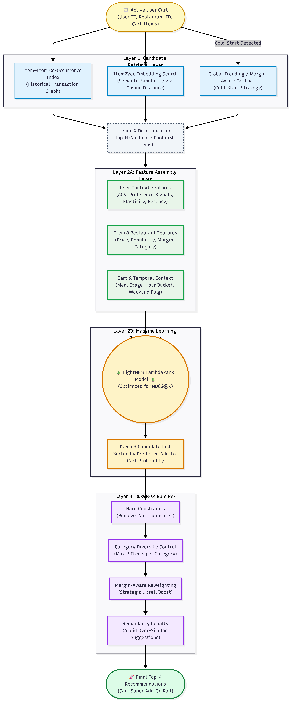

# ZomaThon: End-to-End Workflow

This document illustrates the complete lifecycle of the ZomaThon recommendation engine—from synthetic data generation and offline evaluation to live real-time inference.

## Workflow Execution Diagram

### Phase Details
1. **Offline Data Generation**: Creates the `Parquet` feature store ensuring bimodal delivery times and economic tiering constraints.
2. **Offline Model Training**: Learns global correlations. We process $10,000$ sequential orders to map the semantic relationships inside the LightGBM LambdaRank layers.
3. **Real-time Inference**: Triggered directly by the client API. A high-speed FastAPI layer performing sequential fetching, ranking, and guarding constraint application in $< 100 \text{ms}$. 
4. **Offline Evaluation**: Processes Out-of-Time split data to guarantee NDCG@8 and Precision@8 metric accuracy before online A/B launch.
